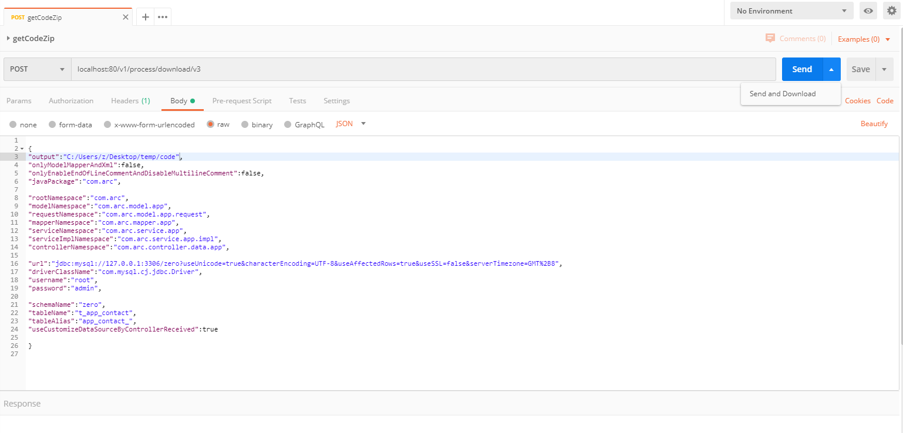
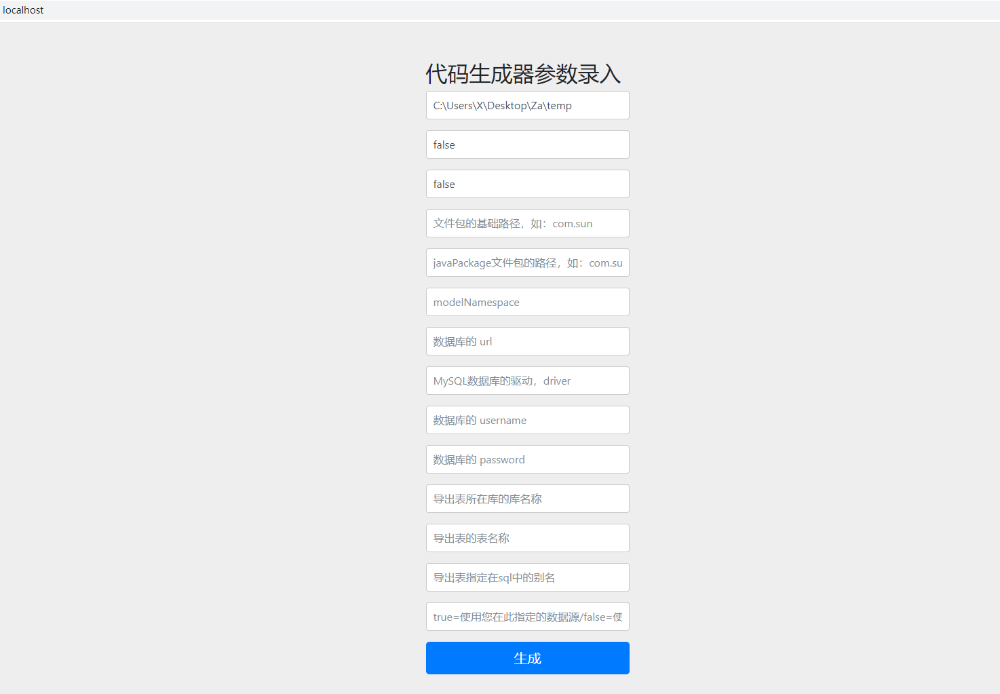

### 项目说明--本项目是用于由数据库生成代码的工具『MySQL』-->『JAVA』 


## 需要优化的
```text
1. Controller Service 返回值
2. Mapper.xml 中的type去掉
3. Mapper.xml 中的别名去掉
4. Request相关包精简
5. 参数由Map传递换用JavaBean
6. @author 需要使用参数注入
终极目标:
6. 输出到一个新项目 应该是可以直接可以执行JUnit测试的!!!
```


参数环境模块
db交互模块
数据预处理模块
模板合成模块
文件输出模块
性能与安全统计模块


-----

start 椭圆
end 椭圆
operation 矩形
subroutine 矩形，宽为小矩形
condition 菱形
inputoutput 平行四边形
-----


```manifest

st=>start:开始
op1=>


```


--

```text

1.  功能：
从MySQL数据库中读取指定表的信息来生成相互适应的代码（model、mapper、service、controller 等）

2. 注意本项目适用环境： 
数据库为MySQL默版本8.0，如果选哟使用5.X则需要调整 1POM依赖 2参数，

 
```

 ##  怎么来传参数生成代码：
```
方案一直接运行main方法构建生产后的代码；[不推荐]

方案二启动web服务器，用postman发一个post请求来获取构建后的代码压缩包;[推荐，样例在文档后面]

方案三启动web服务器，用浏览器来访问一个页面(http://localhost/)，传入参数来获取构建后的代码压缩包：
```
-------

 方案一
```text

找到类com.arc.generator.LaunchGeneratorWithSpringContainerMain，运行其main方法即可

注意：需要事前配置相关参数，配置文件是application.properties

1. 编辑配置文件，填入相关参数，文件：application.properties
2. 启动主方法，com.arc.code.generator.LaunchGeneratorOverSpringContainerMain.main()
3. 在指定目录查看生成的代码

```
方案一完

--------------------------------

方案二： 
[http://localhost/](http://localhost/)

```text
找到类com.arc.generator.LaunchGeneratorWithSpringWebServerMain，运行其main方法启动web容器，参数由controller传入后即可生成*。
参数样例：见本文末尾

注意：
生成的代码返回一个文件压缩包

如果是postman测试的话，send按钮不是有个下拉框吗，选send and Download，获取返回值后悔弹出保存文件按钮，文件后缀修改为zip，就可以了

注意我这边测试是用MySQL8.0测试的，如果您的环境是低版本则需要修改配置文件中的 参数，application.properties 约 第17行 

# 8.0
arc.generator.dataSource.driverClassName=com.mysql.cj.jdbc.Driver

#5.X
arc.generator.dataSource.driverClassName=com.mysql.jdbc.Driver  

```


### API接口说明

编号|待完善 | 名称 | 版本 |  网址
----|----|------|----|----
1|指定较少参数完成项 |重构参数传入机制 | 0.0.2 |  [http://localhost:80/](http://localhost:80/)


### 技术清单

技术 | 名称 | 版本 | 官网
----|------|----|----
SpringBoot | 应用框架 | 2.1.6.RELEASE | [https://projects.spring.io/spring-boot/](https://projects.spring.io/spring-boot/)
MyBatis | ORM框架 | 3.4.6 |  [http://www.mybatis.org/mybatis-3/zh/index.html](http://www.mybatis.org/mybatis-3/zh/index.html)
Maven | 项目构建管理 | 4.0.0 |  [http://maven.apache.org](http://maven.apache.org/)
Freemarker | 模板引擎 | 3.0.9.RELEASE |  [https://freemarker.apache.org/docs/dgui_quickstart_basics.html)
thymeleaf | 模板引擎 | 最新版本 | 用于输出页面  


web版本调用方案一：
用页面，输入参数后去生成
POST localhost:80/v1/process/download/v3
# 测试相对路径图片

body
```json
{
"output":"C:\\Users\\X\\Desktop\\Za\\temp",
"onlyModelMapperAndXml":false,
"onlyEnableEndOfLineCommentAndDisableMultilineComment":false,
"javaPackage":"com.arc",

"rootNamespace":"com.arc",
"modelNamespace":"com.arc.model",
"requestNamespace":"com.arc.model.request",
"mapperNamespace":"com.arc.mapper",
"serviceNamespace":"com.arc.service",
"serviceImplNamespace":"com.arc.service.impl",
"controllerNamespace":"com.arc.controller",

"url":"jdbc:mysql://127.0.0.1:3306/dev?useUnicode=true&characterEncoding=UTF-8&useAffectedRows=true&useSSL=false&serverTimezone=GMT%2B8",
"driverClassName":"com.mysql.cj.jdbc.Driver",
"username":"root",
"password":"admin",

"schemaName":"dev",
"tableName":"sys_data_dictionary",
"tableAlias":"user_",
"useCustomizeDataSourceByControllerReceived":true

}


```


web版本调用方案二：
POST json body to "localhost:80/v1/process/download/v3" body like:

````txt
curl -X POST \
  http://localhost:80/v1/process/download/v3 \
  -H 'cache-control: no-cache' \
  -H 'content-type: application/json' \
  -H 'postman-token: cfbb9e89-b820-9aa4-8f3e-17888752d83c' \
  -d '

{
"output":"C:\\Users\\X\\Desktop\\Za\\temp",
"onlyModelMapperAndXml":false,
"onlyEnableEndOfLineCommentAndDisableMultilineComment":false,
"javaPackage":"com.arc",

"rootNamespace":"com.arc",
"modelNamespace":"com.arc.model",
"requestNamespace":"com.arc.model.request",
"mapperNamespace":"com.arc.mapper",
"serviceNamespace":"com.arc.service",
"serviceImplNamespace":"com.arc.service.impl",
"controllerNamespace":"com.arc.controller",

"url":"jdbc:mysql://127.0.0.1:3306/dev?useUnicode=true&characterEncoding=UTF-8&useAffectedRows=true&useSSL=false&serverTimezone=GMT%2B8",
"driverClassName":"com.mysql.cj.jdbc.Driver",
"username":"root",
"password":"admin",

"schemaName":"dev",
"tableName":"sys_data_dictionary",
"tableAlias":"user_",
"useCustomizeDataSourceByControllerReceived":true


}'

````

方案二完


-------------------------

方案3

    
方案3完


附录：
## 本地部署
- 通过git下载源码
- 创建数据库，数据库编码为UTF-8
- 依次执行sql，初始化数据
- 修改application-dev.yml配置文件，更新MySQL账号和密码
- 运行Maven命令mvn install


### 学习本身就是值得学习的，所以我们需要不断学习
```text
1. 定位问题，给出解决方案
2. 有力执行，及时反馈并修正
3. 总结记录，并继续
```


[记录 tar学习](https://blog.csdn.net/qq_38175730/article/details/82855333)
